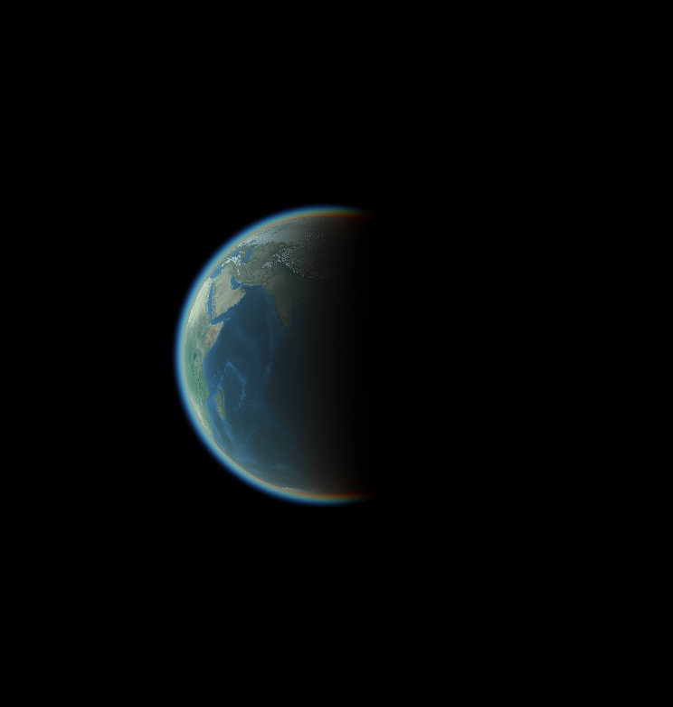

# Eclipse
## Eclipse simulator (incomplete)

This project was supposed to simulate physically accurate solar and lunar eclipses (using correct distance/size ratios between the sun, earth, and moon) using non-hardware-accelerated raytracing - but I didn't have the time to complete it. At least I got nice atmospheric effects with Rayleigh scattering, though.


### Build

```bash
git clone https://github.com/for-loop9/eclipse.git
cd eclipse
glslc app/res/shaders/test.comp -o app/res/shaders/test.spv
premake5 --file=build.lua gmake
make -C build/makefiles config=debug
build/bin/app
```
## Use
Orbit the camera by left-click drag and zoom in/out with mouse wheel. Move around by holding down left shift and then left-click drag.
